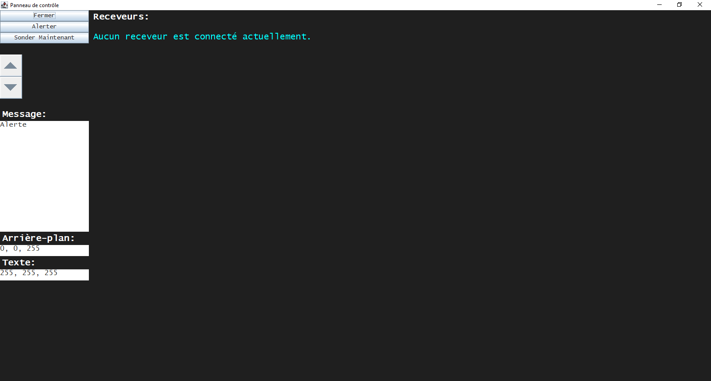
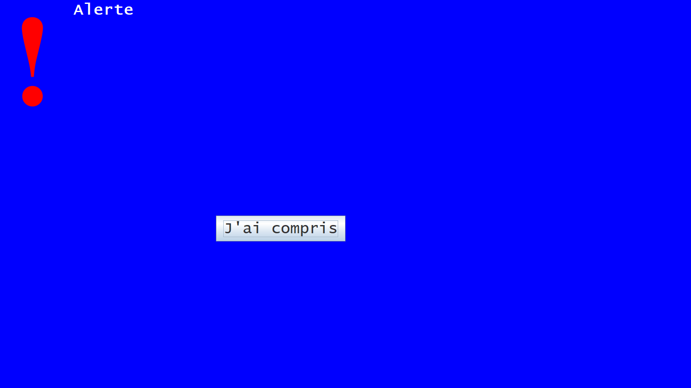

# Documentation pour l'exploitant d'un serveur *popup-alerte-pc*

## 1.	Mise en place de l'exploitation
L'archive `popup-alerte-expl.jar` fournie doit être placée dans le même dossier que le fichier de configuration `expl-config.properties`.
Le fichier de configuration présente 11 paramètres&nbsp;:

 - **accumulatePort** est le port utilisé pour l'initialisation des receveurs. Sa valeur par défaut est de 8080.
 -  **pollingPort** est le port utilisé pour vérifier si un receveur est connecté. Sa valeur par défaut est de 8081.
 -  **alertPort** est le port utilisé pour signaler aux receveurs qu'une alerte doit être appellée. Sa valeur par défaut est de 8082.
 -  **stopPort** est le port utilisé pour arrêter les receveurs. Sa valeur par défaut est de 8083.
 - **pollerInterval** est l'intervalle entre deux sondages (vérification) automatiques, *en millisecondes*. Sa valeur par défaut est de 3600000 (une heure).
> Le tiret bas/tiret du 8 peut être utilisé comme séparateur des milliers. Le point est utilisé en lieu et place de la virgule.
 - **alertText** est le texte par affiché par défaut. **Le saut de ligne requiert le caractère \n.**
 - **presetText** 1, 2 et 3 sont des textes personnalisés pouvant s'afficher à l'écran selon le choix de l'exploitant *(voir infra)*. Ils sont mis en forme de la même manière que alertText.
 - **bgColor** et **textColor** commandent respectivement les couleurs par défaut d'arrière-plan et de texte de l'écran d'alerte.

Pour lancer le serveur, le fichier jar peut être exécuté en double-cliquant dessus, avec un script externe *(solution recommandée si vous avez déjà des programmes de ce genre)*, ou en utilisant un script &nbsp;:

    cd dossier_du_fichier
    java -jar popup-alerte-recv.jar
 
  > Noter qu'il n'est pas possible de charger le fichier de manière indirecte, comme suit&nbsp;:
  > `java -jar "dossier_du_fichier\popup-alerte-recv.jar"`
  > En effet, le programme ne parviendra pas à charger le fichier de configuration; en revanche, un raccourci peut être utilisé.

Lorsque ce programme sera lancé, cette fenêtre apparaîtra&nbsp;:

À gauche figurent plusieurs boutons:

 - **Fermer**&nbsp;: Ce bouton ouvre une boîte de dialogue, proposant d'arrêter l'exploitation ou d'annuler. Si l'option &laquo;&nbsp;Yes&nbsp;&raquo; (Oui) est sélectionnée, les receveurs sont stoppés et le serveur est arrêté. Il provoque le même effet que la croix [X].
> **Important**&nbsp;: Si l'exploitation est arrêtée d'une autre manière, les receveurs n'auront aucun moyen de connaître leur sort, et par conséquent continueront d'attendre pour rien.
- **Alerter**&nbsp;: Ce bouton crée une pop-up proposant d'utiliser le texte personnalisé ou les textes définis dans l'écran de configuration. Il alerte ensuite tous les receveurs connectés, affichant cette fenêtre&nbsp;:

- **Sonder maintenant**&nbsp;: Ce bouton force un sondage&nbsp;; si ce bouton n'est pas pressé, un sondage a lieu avec un intervalle spécifié dans la configuration *(voir supra)*.
- **Haut/Bas**&nbsp;: Ces boutons permettent de monter et descendre dans la liste des receveurs.

Une zone de texte est présente à gauche, permettant d'afficher un écran d'alerte personnalisé.
Deux autres zones permettent de paramétrer les couleurs d'arrière-plan et de texte de l'écran d'alerte, en format RGB.

Les receveurs à droite peuvent présenter plusieurs couleurs suivant leur statut&nbsp;:

 - **Cyan**&nbsp;: Aucun receveur n'est connecté. C'est l'état par défaut du système.
 - **Vert**&nbsp;: Le receveur est connecté et sondé.
 - **Rouge**&nbsp;: Le receveur n'a pas encore été sondé ni alerté.
 - **Jaune**&nbsp;: Le receveur a été alerté, mais n'a pas encore affiché la fenêtre.

## 2.	Mise en place des receveurs
Il existe plusieurs options quant à l'installation des receveurs.

### Pour Windows uniquement&nbsp;:
 - Lancer directement le fichier d'installation situé dans le dossier `Output`, soit par le fichier `popup-alerte-recv-setup.exe`, ou en utilisant le fichier `setup-silent.bat`, qui enlève les fenêtres de confirmation. **Les droits administrateur sont requis.** Le fichier de configuration présente la configuration par défaut. Le programme est paramétré pour se lancer au démarrage&nbsp;; cela peut être modifié en pressant <kbd>Windows</kbd>+<kbd>R</kbd> et en indiquant `shell:common startup` dans la boîte de dialogue&nbsp;; il suffit ensuite de supprimer le fichier raccourci `Popup Alerte PC - Receiver`. L'inconvénient de cette méthode et qu'elle requiert le reparamétrage manuel des fichiers de configuration.
 - Modifier le fichier `popup-alerte-recv-setup.iss` (requiert InnoSetup&nbsp;; il est possible de télécharger ce logiciel [ici](https://jrsoftware.org/isdl.php)). Cette option permet beaucoup plus de personnalisation, notamment&nbsp;:
**Ligne 21**&nbsp;- `DefaultDirName` indique la localisation du dossier d'installation (par 		défaut `C:\Program Files\popup-alerte-pc`)&nbsp;;
**Ligne 41**&nbsp;- Supprimer cette ligne désactive le démarrage automatique de l'application.
Cette option permet aussi la modification du fichier de configuration par défaut. 
Pour pouvoir conserver les modifications, il faut compiler l'exécutable en appuyant sur <kbd>Ctrl</kbd>+<kbd>F9</kbd>.  **Les droits administrateur sont requis.**

Dans les deux cas, un fichier de désinstallation `unins000.exe` est chargé automatiquement dans le dossier d'installation.

### Pour toutes plateformes&nbsp;:
Il faut, comme pour l'exploitation, exporter manuellement les fichiers `popup-alerte-recv.jar` et `recv-config.properties` dans le **même** dossier. Si ils sont placés dans un dossier quelconque, les droits administrateur ne sont **pas** requis.

Le fichier de configuration présente 5 paramètres, soit les 4 ports, les couleurs par défaut et le paramètre **hostname**, qui indique le nom de l'hôte (l'exploitation). Il est mis à `localhost` par défaut.

Le receveur  peut être lancé de la même manière que l'exploitant, avec les mêmes remarques.

## 3. Autres remarques 
Les logs se trouvent dans `%APPDATA%\popup-alerte-pc`.